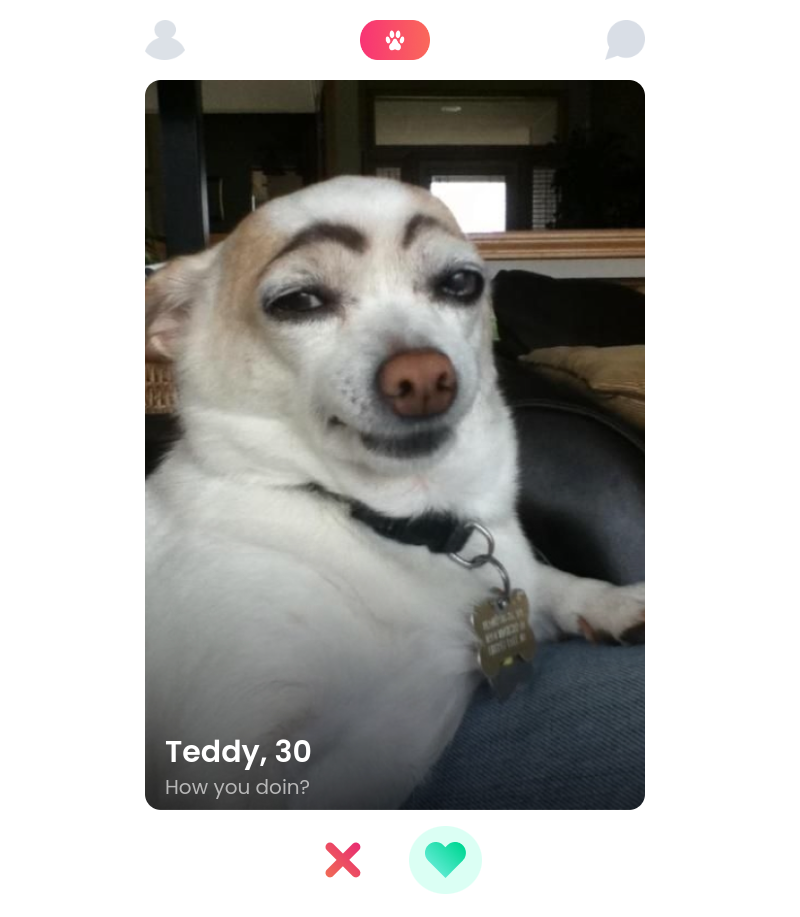
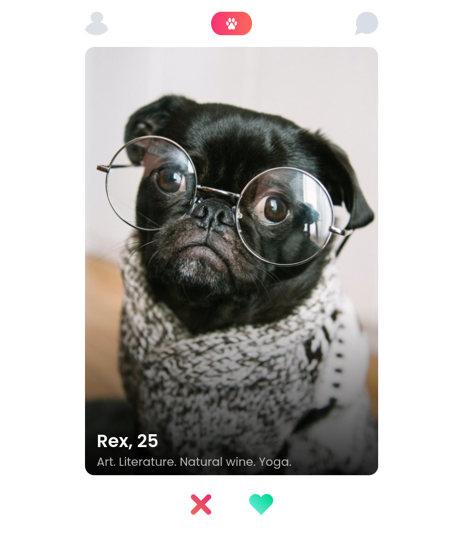
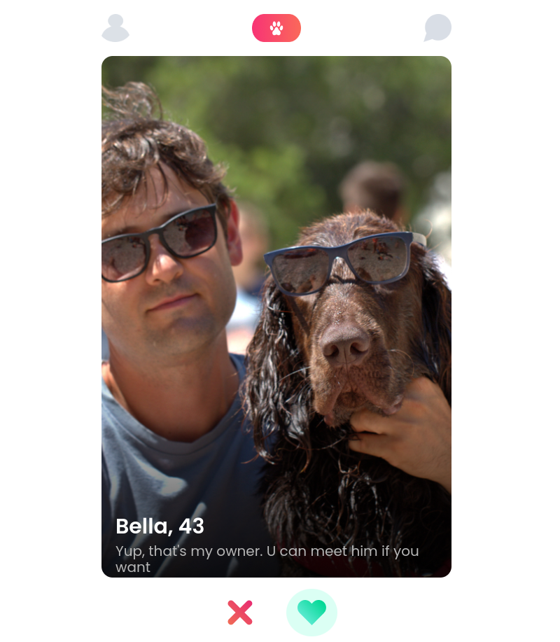

# About Tindog Project

https://tindog-best-dogs.netlify.app/

> Tindogs which they can do many things, and they have several skills

1. By clicking **_X_** icon you will vote it *Nope*
2. By clicking **_Heart_** icon you will vote it *Like*


### Teddy, 30




### Rex, 25 

+ Art. Literature. Natural wine. Yoga





### Bella, 43





-----

## Cloning the project 🪛🔨

```
# Clone this repository
$ git clone https://github.com/MastooraTurkmen/Tindog-project.git

# Go inside the repository
$ cd Tindog-project
```

-----

## Languages and Tools are used 🗣️ 🔧

1. **Languages** 🗣️
    + [HTML](https://github.com/topics/html)
    + [HTML5](https://github.com/topics/html5)
    + [CSS](https://github.com/topics/css)
    + [CSS3](https://github.com/topics/css3)
    + [JavaScript](https://github.com/topics/javascript)

2. **Tools** 🔧
    + [Chrome](https://github.com/topics/chrome)
    + [VSCode](https://github.com/topics/vscode)
    + [Figma](https://github.com/topics/figma)
    + [Netlify](https://github.com/topics/netlify)


-----

## Deployment📥

1. How to deploy our project to the Netlify site?
2. I use [Netlify App](https://app.netlify.com/) for deploying my projects.
3. Go to the Netlify site and select Add a new site.
4. From there select **_Deploy with Github_**.
5. Then write your project name and select it.
6. After selecting here you can see that the project **_Review configuration for Tindog-project_** and then select the **_Deploy Tindog-project_** Button.
7. Now your project is Live.


-----


## Author 👩🏻‍💻 

**Mastoora Turkmen**  
[LinkedIn](https://www.linkedin.com/in/mastoora-turkmen/) 
<br>
[Github](https://github.com/MastooraTurkmen/) 
<br>
[Twitter](https://twitter.com/MastooraJ22)


------


# Codes that are used

1. ***Index HTML***
2. ***Index CSS***
3. ***Index JS***
  + ***Dog JS***
  + ***Data JS***


## Index HTML

```html
<!DOCTYPE html>
<html lang="en">
<head>
    <meta charset="UTF-8">
    <link rel="icon" type="image/svg+xml" href="./images/logo.png" />
    <meta name="viewport" content="width=device-width, initial-scale=1.0">
    <link rel="stylesheet" href="https://cdnjs.cloudflare.com/ajax/libs/normalize/8.0.1/normalize.css">
    <link rel="stylesheet" href="index.css">
    <link rel="preconnect" href="https://fonts.googleapis.com">
    <link rel="preconnect" href="https://fonts.gstatic.com" crossorigin>
    <link href="https://fonts.googleapis.com/css2?family=Poppins:wght@300;400;600&display=swap" rel="stylesheet">
    <title>TinDogs</title>
</head> 
<body>
    <header>
        <div class="icons">
            
            
            
        </div>
    </header>
    
    <section>
        <div class="main" id="main">
        </div>
    </section>
    
    <section class="button">
        <button class="liked-btn" id="liked-btn"></button>
        <button class="Nope-btn" id="Nope-btn"></button>
    </section>
    
        <script src="/index.js" type="module"></script>
</body>
</html>
```


## Index CSS

```css
html, 
body{
    font-family: 'Poppins', sans-serif;
    color: #ffff;
}


/* ////////////////// 
      Typography
////////////////// */


h2{
    color: white;
    padding-top: 630px;
    margin-bottom: 7px;
}

p{
    color: #B7B7B7;
    margin-bottom: 30px;

}

h2, p{
    margin-left: 20px;
}


img{
    max-width: 100%;
}

/* /////////////
  Buttons
/////////////// */

button{
    border: none;
    border-radius: 50%;
    padding: 16px;
    margin: 16px;
    background: #ffff;
}

.button{
    display: flex;
    justify-content: center;
}

#Nope-btn:hover, 
#Nope-btn:focus{
    background: #DBFFF4;
}

#liked-btn:hover,
#liked-btn:focus{
    background: #FFE7EF;
}

/* ///////////////
  icons and logs
///////////////// */

.icons{
    display: flex;
    justify-content: space-between; 
    margin-top: 20px;
    margin-bottom: 20px;  
}


.small-icon{
   width: 40px;
   height: 40px;
}

.logo-icon{
    width: 70px;
}

.main, header {
    max-width: 95%;
    margin: 0 auto;
}

@media (min-width: 550px){
    header {
        max-width: 500px;
    }
}


/* ///////////////
   main-section
///////////////// */


.main{
    display: flex;
    justify-content: center;
    background-size: cover;
    object-fit: cover;
    position: relative;
    border-radius: 16px;
    height: 745px;
    width: 500px;
}

.information{
    height: 700px;
    width: 500px;
}

.Badge-images{
    display: flex;
    position: absolute;
    width: 40%;
    top: 9%;
    left: 5%;
    rotate: -35deg;
}

.bio{
    margin-top: 0px;
    padding-top: 0px;
    margin-bottom: 30px;
}

```

## Index JS

```js
import Dog from './Dog.js'
import dogs from './data.js'


const newgetDogs = () => {
    const freshDog = dogs.shift()
    dogs.push(freshDog)
    return freshDog
}

document.getElementById('liked-btn').addEventListener('click', (e) => {
    dog.hasBeenLiked = true
    anotherDog()
})

document.getElementById('Nope-btn').addEventListener('click', (e) =>{
    anotherDog()
})

function anotherDog(){
    dog.hasBeenSwiped = true
    renderDog()
    dog = new Dog(newgetDogs())
    setTimeout(()=>{
        renderDog()
    }, 2000)
}

function renderDog(){
    document.getElementById('main').innerHTML = dog.getDogHtml()
    document.getElementById('main').style.background = `url(${dog.avatar})`
    document.getElementById('main').style.backgroundSize = "cover"
}

let dog = new Dog(newgetDogs())
renderDog()

```


### Dog JS

```js
class Dog{
    constructor(data){
        Object.assign(this, data)
    }
    
    getDog(){
        const {name, age, bio} = this
        return `
             <div class="information">
                    <h2>${name}, ${age}</h2>
                    <p class="bio">${bio}</p>
                </div>
        `
    }

    setBadgeHtml(){
        if(this.hasBeenSwiped){
            if(this.hasBeenLiked){
                return ``
            } else {
                return ``
            } 
        } else{
            return ""
        }
    }

    getDogHtml(){
        return `
        <div class ="dog-card" id="dog-card">
            ${this.getDog()}
        </div>
        
        <div class="Badge-images">
            ${this.setBadgeHtml()}
        </div>
        
       `
       }
}

export default Dog

```


### Data JS

```js

const dogs = [
    {
        name: "Rex",
        avatar: "https://i.postimg.cc/T1HzN1fB/dog-rex.jpg",
        age: 25,
        bio: "Art. Literature. Natural wine. Yoga.",
        hasBeenSwiped: false,
        hasBeenLiked: false
    },{
        name: "Bella",
        avatar: "https://i.postimg.cc/hjYsHdQ8/dog-bella.jpg",
        age: 43,
        bio: "Yup, that's my owner. U can meet him if you want",
        hasBeenSwiped: false,
        hasBeenLiked: false
    },
    {
        name: "Teddy",
        avatar: "https://i.postimg.cc/zGKzFrV3/dog-teddy.jpg",
        age: 30,
        bio: "How you doin?",
        hasBeenSwiped: false,
        hasBeenLiked: false
    }
    ]

export default dogs

```

-------


## Updating the images to the direct links 🔗 🖇

I updated image data to direct links because when I uploaded to Netlify, my images didn't show,
so I used the ***"PostImages"*** https://postimages.org/