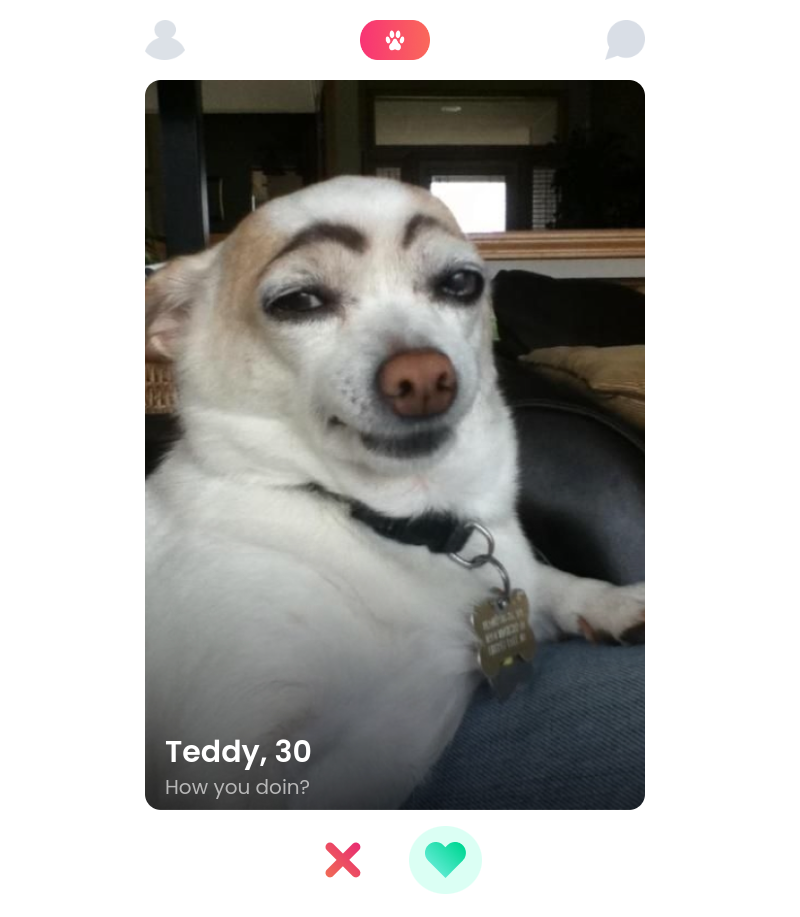
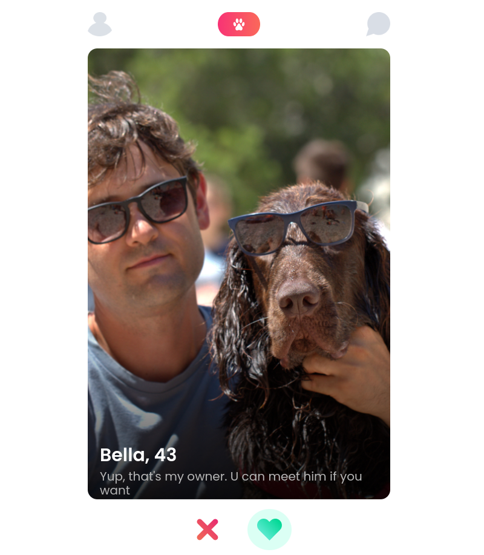

# Tindog
Quick start:

```

$  npm run dev
$  npm start

```

Head over to https://vitejs.dev/ to learn more about using vite


## About Tindog Project

https://tindog-best-dogs.netlify.app/

> Tindogs which they can do many things, and they have several skills

1. By clicking **_X_** icon you will vote it *Nope*
2. By clicking **_Heart_** icon you will vote it *Like*


### Teddy, 30




### Rex, 25 

+ Art. Literature. Natural wine. Yoga


### Bella, 43





## Languages and Tools are used

1. **Languages** 🗣️
    + [HTML](https://github.com/topics/html)
    + [HTML5](https://github.com/topics/html5)
    + [CSS](https://github.com/topics/css)
    + [CSS3](https://github.com/topics/css3)
    + [JavaScript](https://github.com/topics/javascript)

2. **Tools** 🔧
    + [Chrome](https://github.com/topics/chrome)
    + [VSCode](https://github.com/topics/vscode)
